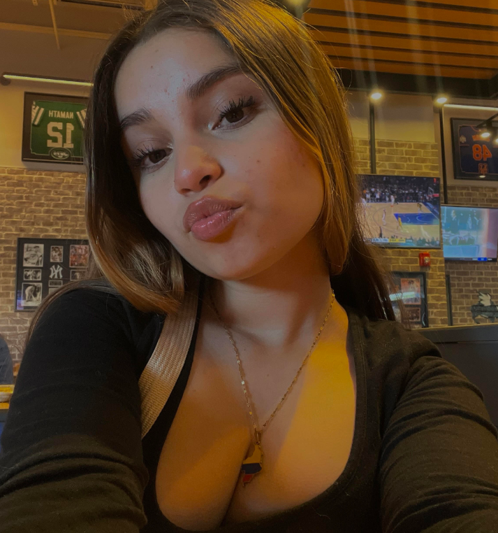
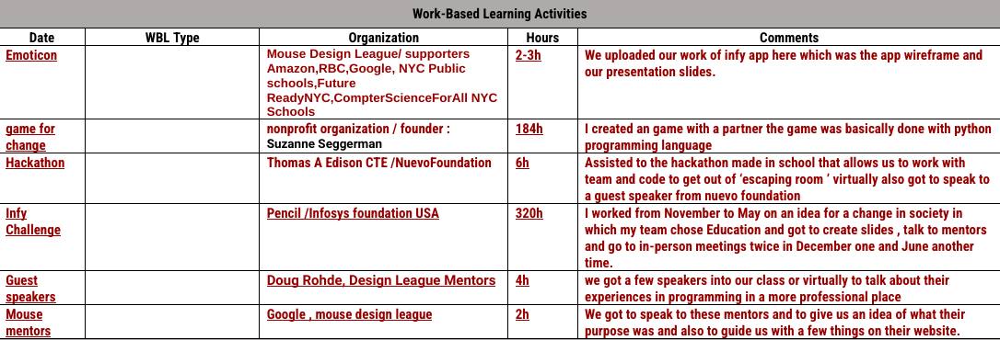

<!DOCTYPE html>
<html>
<head>
  <meta charset="utf-8">
  <meta name="viewport" content="width=device-width">
  <title>Junior--Final Portafolio</title>
  <link href="icon.png" rel="icon" type="image/png" />
  <link href="style.css" rel="stylesheet" type="text/css" />
</head>
  <body>
    <h1 style="text-align: center ;font-family:cursive;">Welcome to My Portfolio</h1>
    <h4 style="text-align: center; font-family:monospace;">Sol Pulido</h4>
    <h4 style="text-align: center; font-family:monospace;">05/31/24</h4>
    <h4 style="text-align: center; font-family:monospace;">Programming & Prototyping -Mrs. Ramirez </h4>
    
    

      <h2 style="text-align: center; color: gold; font-family:fantasy;font-size: 30px;">About Me</h2>
      
      

    Hey! I am a student at Thomas A Edison High School,This is the last Portafolio for our 2024 school year.
     
    This portafolio is showing all our work & my work from September 2023 to June 2024,It also highlights my skills and how much I have improve this Junior year.
        

    

    
    <h1 style="color: hotpink;"> Dive into my school year!</h1>
    
MENU:
    <a href="project.html">See Projects</a>
    

    <h2> Additional INFO</h2>
    

      "
    

  </body>
  
  

</html>
