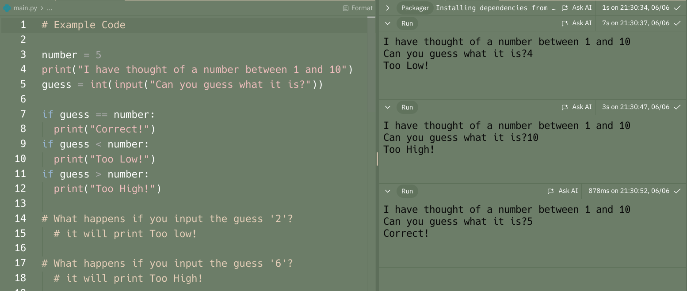
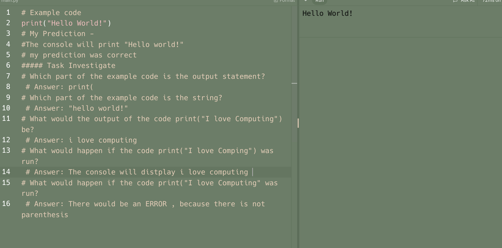

<!DOCTYPE html>
<html>
<head>
  <meta charset="utf-8">
  <meta name="viewport" content="width=device-width">
  <title>Junior--Final Portafolio</title>
  <link href="icon.png" rel="icon" type="image/png" />
  <link href="style.css" rel="stylesheet" type="text/css" />
</head>
  <body>
    <h1 style="text-align: center ;font-family:cursive;">#Welcome to My Portfolio</h1>
    <h4 style="text-align: center; font-family:monospace;">Sol Pulido</h4>
    <h4 style="text-align: center; font-family:monospace;">05/31/24</h4>
    <h4 style="text-align: center; font-family:monospace;">Programming & Prototyping -Mrs. Ramirez </h4>
    
 

      <h2 style="text-align: center; color: gold; font-family:fantasy;font-size: 30px;">About Me</h2>
      
      

    Hey! I am a student at Thomas A Edison High School,This is the last Portafolio for our 2024 school year.
     
    This portafolio is showing all our work & my work from September 2023 to June 2024,It also highlights my skills and how much I have improve this Junior year.
        

    

    
  <h1 style="color: hotpink;"> Dive into my school year!</h1>
    
MENU:
    <a href="project.html">See Projects</a>
    

  <h2> Additional INFO</h2>
    

      "
    

  </body>
  
  

</html>

#second page 
<!DOCTYPE html>
<html>
<head>
  <meta charset="utf-8">
  <meta name="viewport" content="width=device-width">
  <title>Final Portafolio -- project's</title>
  <link href="icon.png" rel="icon" type="image/png" />
  <link href="style.css" rel="stylesheet" type="text/css" />
</head>
  <body>
    <h1 style="text-align: center ;font-family:cursive;">Welcome to my Projects</h1> 
    <h4 style="text-align: center; font-family:monospace;">2023-2024</h4>
   
  

    CHECK MY September - June PROJECTS HERE: Iteration UNIT
        

        <a href="https://replit.com/@PPPython23-24/Iteration-make" target="_blank">Iteration Make</a>
        

        

        
          

        

   

      <a href="https://replit.com/@PPPython23-24/43-Iteration-Modify-SOL-ADALYADALY" target="_blank">Iteration Modify</a>
      

      

      
        

  

          <a href="https://replit.com/@PPPython23-24/41-Iteration-Predict-and-Run-SOL-ADALYADALY" target="_blank">Iteration Predict & Run</a>
          

          

          
            

  

          <a href="https://replit.com/@PPPython23-24/40-Iteration-Unit-Overview-SOL-ADALYADALY" target="_blank">Iteration UNIT_OVERVIEW</a>
          

          

          
            

    
        This Unit was mostly about Iteration, I learned how to use the while loop and for loop.
    

   

      HERE: Selecting ELIF
          

          <a href="https://replit.com/@PPPython23-24/Condtionals-make-ELIF" target="_blank">Conditionals Make</a>
          

          

          
            

  

        <a href="https://replit.com/@PPPython23-24/312-Conditionals-Modify-SOL-ADALYADALY" target="_blank">Conditionals Modify</a>
        

        

        
          

   

            <a href="https://replit.com/@PPPython23-24/311-Conditionals-Investigate-SOL-ADALYADALY" target="_blank">Conditionals Investigate</a>
            

            

            
              

   

            <a href="https://replit.com/@PPPython23-24/310-Conditionals-Predict-and-Run-SOL-ADALYADALY" target="_blank">Conditionals Predict & Run</a>
            

            

            
              

    
      In this unit, We learned about ELIF, I learned how to use it in different situacions and mostly practiced with text and numbers.

  

        HERE: Selection If Else
            

            <a href="https://replit.com/@PPPython23-24/conditionals-makeif-ELSE" target="_blank">Make</a>
            

            

            
              

   

          <a href="https://replit.com/@PPPython23-24/37-Conditionals-Modify-SOL-ADALYADALY" target="_blank">Modify</a>
          

          

          
            

   

              <a href="https://replit.com/@PPPython23-24/36-Conditionals-Investigate-SOL-ADALYADALY" target="_blank">Investigate</a>
              

              

              
                

   

              <a href="https://replit.com/@PPPython23-24/35-Conditionals-Predict-and-Run-SOL-ADALYADALY" target="_blank">Predict & Run</a>
              

              

              
                

        

          <a href="https://replit.com/@PPPython23-24/34-Conditionals-Unit-Overview-SOL-ADALYADALY#main.py" target="_blank">Unit Overview(IN CLASS)</a>
          

   
        In this unit we work on selection, I learned how to use if else, and how to use work with it with the help of these projects.

  

          HERE: Functions
              

              <a href="https://replit.com/@PPPython23-24/33-Functions-Make-SOL-ADALYADALY" target="_blank">Functions Make</a>
              

              

              
                

  

            <a href="https://replit.com/@PPPython23-24/32-Functions-Modify-SOL-ADALYADALY" target="_blank">Functions Modify</a>
            

            

            
              

   

                <a href="https://replit.com/@PPPython23-24/36-Conditionals-Investigate-SOL-ADALYADALY" target="_blank">Function Investigate</a>
                

                

                
                  

   

                <a href="https://replit.com/@PPPython23-24/30-Functions-Predict-and-Run-SOL-ADALYADALY" target="_blank">Functions Predict & Run</a>
                

                

                
                  

          

            <a href="https://replit.com/@PPPython23-24/Functions-Unit-Overview-SOL-ADALYADALY" target="_blank">Unit Overview(IN CLASS)</a>
            

    
          Here in this unit we learned about functions,the different ways you can interact and use them.

          
  

            HERE: Calculations
                

                <a href="https://replit.com/@PPPython23-24/Calculation-Make" target="_blank">calculations Make</a>
                

                

                
                  

   

              <a href="https://replit.com/@PPPython23-24/22-Calculation-Modify-SOL-ADALYADALY" target="_blank">calculations Modify</a>
              

              

              
                

  

                  <a href="https://replit.com/@PPPython23-24/21-Calculation-Investigate-SOL-ADALYADALY" target="_blank">calculations Investigate</a>
                  

                  

                  
                    

   

                  <a href="https://replit.com/@PPPython23-24/20-Calculation-Predict-SOL-ADALYADALY" target="_blank">calculations Predict & Run</a>
                  

                  

                  
                    

            

              <a href="https://replit.com/@PPPython23-24/2-Unit-Overview-SOL-ADALYADALY" target="_blank">Unit2 Overview</a>
            

              

              
              

    
            On this lesson we learned about calculations, and how to use them correctly

   

              HERE: Inputs
                  

                  <a href="https://replit.com/@PPPython23-24/Do-Now-Using-python" target="_blank">Do Now with Python</a>
                  

                  

                  
                    

   

                <a href="https://replit.com/@PPPython23-24/110-Input-Make-SOL-ADALYADALY" target="_blank">Input Make</a>
                

                

                
                  

   

                    <a href="https://replit.com/@PPPython23-24/19-Input-Modify-SOL-ADALYADALY" target="_blank">Input Modify</a>
                    

                    

                    
                      

  

                    <a href="https://replit.com/@PPPython23-24/32-Investigate-SOL-ADALYADALY" target="_blank">Input Investigate</a>
                    

                    

                    
                      

              

                <a href="https://replit.com/@PPPython23-24/31-Predict-and-Run-Input-SOL-ADALYADALY" target="_blank">Input Predict & run</a>
              

                

                
                

    
              In this lesson we learned some of the basics of inputs but instead using them in python.

   

                HERE: Variables Assignment
                    

                    <a href="https://replit.com/@PPPython23-24/24-Make-Variables-SOL-ADALYADALY" target="_blank">Variable Make</a>
                    

                    

                    
                      

   

                  <a href="https://replit.com/@PPPython23-24/23-Modify-Variable-SOL-ADALYADALY" target="_blank">Variable Modify</a>
                  

                  

                  
                    

   

                      <a href="https://replit.com/@PPPython23-24/22-Investigate-Variable-SOL-ADALYADALY" target="_blank">Variable Investigate</a>
                      

                      

                      
                        

   

                    <a href="https://replit.com/@PPPython23-24/21-Predict-and-Run-SOL-ADALYADALY" target="_blank">Variable Predict & run</a>
                      

                      

                      
                        

    
                On this lesson specifically we learned about variables, and how to use them in python and even in other languages.

 

                  HERE: Output 
                      

                      <a href="https://replit.com/@PPPython23-24/13-Output-Make-SOL-ADALYADALY" target="_blank">Output Make</a>
                      

                      

                      
                        

 

                    <a href="https://replit.com/@PPPython23-24/12-Output-Modify-SOL-ADALYADALY" target="_blank">Output Modify</a>
                    

                    

                    
                      

  

                        <a href="https://replit.com/@PPPython23-24/11-Output-Predict-Run-and-Investigate-SOL-ADALYADALY" target="_blank">Output Predict , Run & Investigate</a>
                        

                        

                        
                          

   
                 this lesson had less project but we learned about outputs and analyze them more closely.

   

                    HERE: Big Projects 
                        

                        <a href="https://replit.com/@PPPython23-24/Project-3-ChatBot-SOL-ADALYADALY" target="_blank">ChatBot</a>
                        

                        

                        
                          

   

                      <a href="https://replit.com/@PPPython23-24/Bouncing-Ball" target="_blank">Bouncing Ball</a>
                      

                      

                      
                        

   

                          <a href="https://replit.com/@PPPython23-24/Room-Area" target="_blank">Room Area</a>
                          

                          

                          
                            

                    
   

                      <a href="https://replit.com/@PPPython23-24/Project-1-Silly-Sentences-SOL-ADALYADALY" target="_blank">Silly Sentences</a>
                      

                      

                      
                        

                    
   

                      <a href="https://replit.com/@PPPython23-24/MyPythonPortfolioOnTheWeb-SOL-ADALYADALY" target="_blank">Python Portafolio In Web</a>
                      

                      

                      
                        

   

                      <a href="https://2260e679-b8af-4ff3-8ea6-b31e44df1f72-00-18j7spml37ux0.picard.replit.dev/index.html" target="_blank">Infy App Challenge</a>
                      

                      

                      
                        

  
                   These were one of the most importants projects we did in this unit/year. We learned how to use the python language and how to use it in a more complex way

 

                      HERE: Graphics 
                          

                          <a href="https://replit.com/@PPPython23-24/Avatar-CMU" target="_blank">Avatar CMU</a>
                          

                          

                          
                            

  

                        <a href="https://replit.com/@PPPython23-24/Generating-color-dots" target="_blank">generate Dots</a>
                        

                        

                        
                          

                       
                       This 2 were a more fun project in ehich we did graphics and animations kind of like in scratch.
      

   <h1 style="color: hotpink;"> Go Back If your done</h1>
                    
MENU:
                    <a href="index.html">Go back Home</a>
                    

  </body>

</html>
